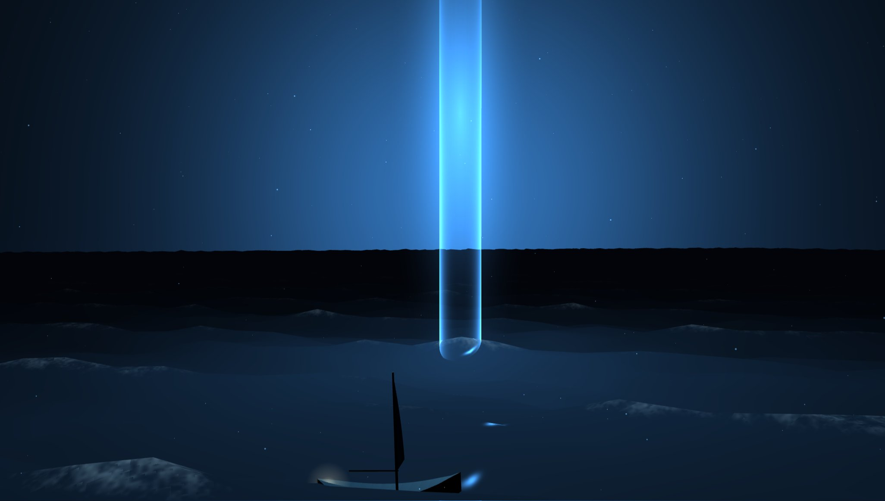
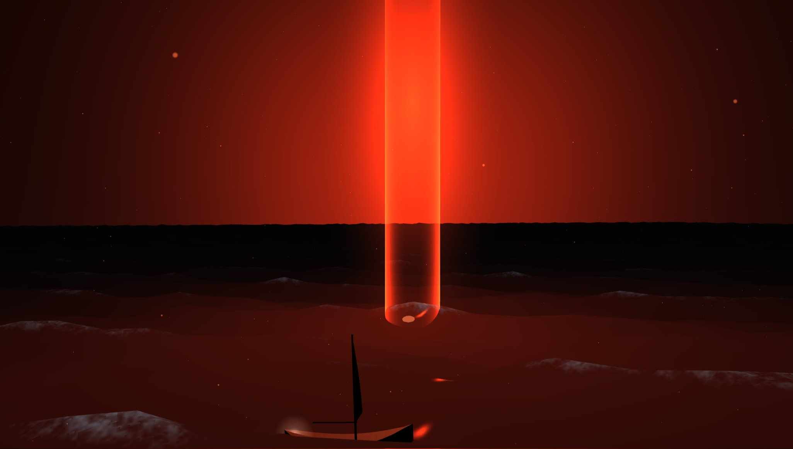
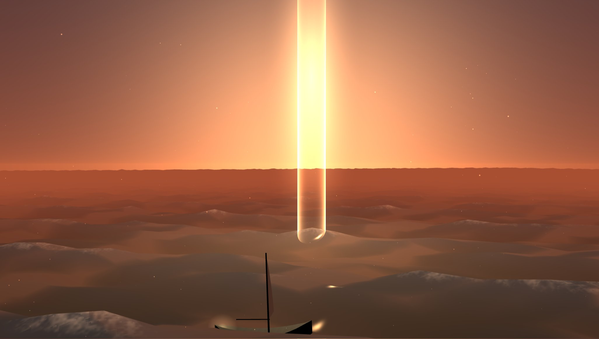

# Nightsail

Open water at night, a column of light standing on it, and a small boat going past. The sea, the sky,
the hull, the sail and the specks drifting in the air are all generated from code at start-up, and
every number that shapes them is on a slider.

**Live demo:** https://kloserock97-tech.github.io/nightsail/



## The idea

The scene is built around one rule: the boat has to ride the water the shader draws, not a
simplified copy of it. Most "boat on waves" demos bob the boat on a sine wave that has nothing to do
with the surface underneath, and it shows the moment the swell gets bigger. Here the wave train is
data — six vectors uploaded to the GPU — and the exact same sum is evaluated once more on the CPU at
the boat's position. The boat takes its height and its tilt from that result, so when the sea turns
rough it heels over on the actual crest it is sitting on.

## The water

A sum of six Gerstner waves. Unlike sines, Gerstner waves move points sideways as well as up and down,
which is what gives a swell a sharp crest and a long flat trough. The train is derived from a single
wind direction: each wave is shorter, slower and lower than the one before it, and they fan out
around the wind so the ridges never line up into corridors. Wave speed follows deep-water dispersion
(long waves travel faster), which quietly does a lot of the work of making it read as water.

Shading is written by hand and deliberately cheap. There is no reflection pass and no environment map:

- deep and crest colours mixed by how far up the wave a point is,
- a fresnel rim that turns grazing water into sky,
- a tilt term, because a sloped face reflects higher up the sky than a flat one,
- the light column as a light: a radial spill around its base and a glint path that follows the viewer,
- foam where crests get steep, broken up by two octaves of value noise,
- squared-exponential haze, so the water near the boat stays water and the horizon melts into the sky.

## The light

Three additive pieces and no lights of their own: an open cylinder for the shaft, a billboard for the
bloom, a hot spot at the waterline. The shaft is brightest at its silhouette and faintest in the
middle, the way a glass tube is, because at the edges you look through more of it. It starts a few
units under the surface so it reads as light standing in the water, not a tube hanging over it. A
slow two-frequency pulse keeps it from looking like a still image.

## The boat

There is no model file. The hull is drawn the way a shipwright draws one: stations along the length,
each with a half-width and a depth, a fine bow, a full middle and a cut-off stern, and a sheer line
that lifts towards both ends. The surface is stitched between neighbouring stations with flat
normals. Length, beam, draft, sheer, mast and sail are all sliders, so the same code makes a dinghy
or a long low skiff. A lantern on the stern is the only warm thing in the frame.

## Controls

| Folder | What's in it |
| --- | --- |
| **Sea** | swell height, wavelength, steepness, speed, wind direction and spread, water colours, foam, glossiness, sky reflection |
| **Sky and air** | zenith and horizon colours, stars, haze, drifting motes (count, size, drift, colour) |
| **The light** | colour, height, radius, intensity, spill on the water, how far the spill reaches, pulse |
| **Boat** | speed, distance from the light, hull shape, mast, sail, colours, lantern |
| **View** | exposure, auto orbit, freeze time |

`H` hides the panel, `Space` freezes time, drag to orbit, scroll to zoom.

Presets: night, dawn, storm, beacon, ice. **Copy link to this night** writes the whole setup into the
address bar, so a version you like can be sent as a plain URL.

| storm | beacon | dawn |
| --- | --- | --- |
|  |  |  |

## Performance

About a dozen draw calls, and one of them does the real work: the water, a 320×320 grid of about
100k vertices, six waves per vertex. The fragment work on it is a handful of arithmetic and two
value-noise lookups. On an Intel Arc integrated GPU the default night runs at over 150 fps at
1368×775. If a machine struggles, **swell height** costs nothing while **motes** do, and the water
grid size is one number in `src/ocean.js`.

## Running it

Node 22 or newer.

```bash
npm install
npm run dev       # http://localhost:5173
npm run build     # static site into dist/
npm run preview
```

`.github/workflows/deploy.yml` publishes `dist/` to GitHub Pages on every push to `main`.

| File | What it is |
| --- | --- |
| `src/waves.js` | the wave train, once as data, once as GLSL, once as a JS sampler |
| `src/ocean.js` | water mesh and shading |
| `src/sky.js` | gradient dome, glow around the light, stars |
| `src/pillar.js` | the light column |
| `src/boat.js` | hull generator, mast, sail, lantern |
| `src/motes.js` | drifting points in a wrapping box around the camera |
| `src/settings.js` | defaults, presets, URL encoding |
| `src/main.js` | scene, panel, loop |

## Prior art

A lit column on a night sea is a composition you will have seen before in motion design; the scene
here, the wave model, the shading, the hull generator and the panel are my own work, written from
scratch. Built with [three.js](https://threejs.org) and [lil-gui](https://lil-gui.georgealways.com).

## Licence

MIT — see [LICENSE](LICENSE).

Nikita Gorbachev · kloserock97@gmail.com ·
[LinkedIn](https://www.linkedin.com/in/nikita-gorbachev-productdesigner)
