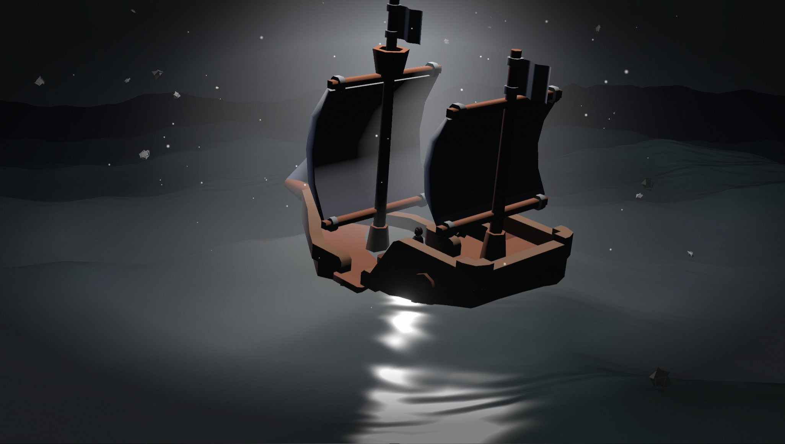

# Nightsail

A column of light over a stormy night sea, and a small boat right under it with a figure looking up.
Sparks boil off the core, threads of a curl field wind around it, shards drift through the air and the
water breaks the light into a path of glints. Every value that shapes the scene is on a panel, and a
night you like can be sent as a link.

**Live demo:** https://kloserock97-tech.github.io/nightsail/


## The idea

There is exactly one light in this scene and it stands at a known point. So almost nothing is lit by a
lighting system: the sea, the shards and the air each brighten by how much they face the core and how
close they are to its axis. That keeps a busy frame fast, and it makes the light feel like the only thing
in the world.

## The light

- **Column.** A single plane turned to the camera, with a gaussian falloff across it, a pinch at the core
  and a noise texture along it. A plane has no silhouette, which a cone or a cylinder always does. Where it
  cuts through the boat it fades by comparing its depth with the scene's, so there is no seam.
- **Core.** 5,400 sparks sampled on an icosphere, each breaking away along its normal and carried by a CPU
  curl-noise field, so the core boils instead of glowing.
- **Threads.** 520 short paths traced through the field once at start-up and baked into ribbons; a bright
  head runs along each. The field does not change, so there is no reason to trace it every frame.
- **Dust and shards.** Sparse sparks settling towards the column and 150 dented rocks drifting up, for
  parallax.
- **Lens.** Bloom, a band blur that softens the top and bottom of the frame, and lens flares drawn from the
  projected position of the core rather than extracted from bright pixels.

## The sea

Four directional sines with sharpened crests, plus three ripples that bend the normal but never move the
surface. The swell is written once in the shader and once in JavaScript, and the boat takes its height and
tilt from the JavaScript copy, so it rides the crest it is actually on. The water reflects the same sky
panorama that sits behind it, with Schlick fresnel, light through thin crests, a glint path on the half
vector, foam on steep slopes and mist that stays in the troughs.

The sky is an HDR panorama rendered once in Blender Cycles: a light column inside height-falling haze.

## The boat

Three low-poly boats to choose from: a rowboat, a sloop and a two-masted ship. Each is scaled to a length
and sunk to its own waterline. The figure is placed by casting a ray down onto the deck, so it stands on
whichever boat is loaded, and its head is tipped towards the light on top of its idle animation.

| Storm, sloop | Ember | The ship |
| --- | --- | --- |
|  |  |  |

## Controls

`H` hides the panel, `Space` freezes time, drag to orbit, scroll to zoom.

| Folder | What's in it |
| --- | --- |
| **Time** | speed of everything |
| **Boat** | model, size, draft, position, heading, how much it follows the waves, brightness, figure, how far the figure looks up |
| **Light** | colour of the light, how strongly it lights the boat, moonlight, ambient |
| **Column, Halo** | shape, width and falloff of the column, halo around the core |
| **Core sparks, Threads, Dust, Shards** | everything that moves around the core |
| **Sea** | swell, colours, reflection, ripples, light through crests, foam, glint, mist |
| **Sky and air** | panorama or plain gradient, fog, glow around the column, mist |
| **Lens** | bloom, flare strength, spread and tint, band blur |
| **View** | field of view, camera breathing, auto rotation |

Presets: night, storm, calm, ember, ghost. **Copy link to this night** puts every changed value into the
address. Add `#webgl=1` to force the WebGL2 path.

## Running it

Node 22 or newer.

```bash
npm install
npm run dev       # http://localhost:5173
npm run build     # static site into dist/
npm run preview
```

`.github/workflows/deploy.yml` publishes `dist/` to GitHub Pages on every push to `main`.

| File | What it is |
| --- | --- |
| `src/main.js` | renderer, scene, camera, loop |
| `src/light.js` | column and halo |
| `src/sparks.js` | core sparks and dust |
| `src/flow.js` | baked threads around the core |
| `src/curl.js` | the CPU curl field |
| `src/debris.js` | drifting shards |
| `src/ocean.js` | the sea, in the shader and on the CPU |
| `src/sky.js` | panorama loading and a small RGBE reader |
| `src/boat.js` | boat models, draft, the figure on deck |
| `src/post.js` | bloom, band blur, lens flares |
| `src/panel.js` | panel rows, presets, address encoding |

## Performance

About 90 fps at 1368×775 on an Intel Arc integrated GPU, on both the WebGPU and the WebGL2 path.
The sea is the heaviest piece: a 200×200 grid with the swell evaluated three times per vertex.

## Credits

Scene, shaders and panel are my own work. Built with [three.js](https://threejs.org) (MIT) and
[lil-gui](https://lil-gui.georgealways.com) (MIT). Boats are from the Pirate Kit by
[Kenney](https://kenney.nl) and the figure is "Hoodie Character" by [Quaternius](https://quaternius.com),
both released under CC0. The sky was rendered for this project. Details in
[THIRD_PARTY_NOTICES.md](THIRD_PARTY_NOTICES.md).

## Licence

MIT, see [LICENSE](LICENSE).

Nikita Gorbachev · kloserock97@gmail.com ·
[LinkedIn](https://www.linkedin.com/in/nikita-gorbachev-productdesigner)
