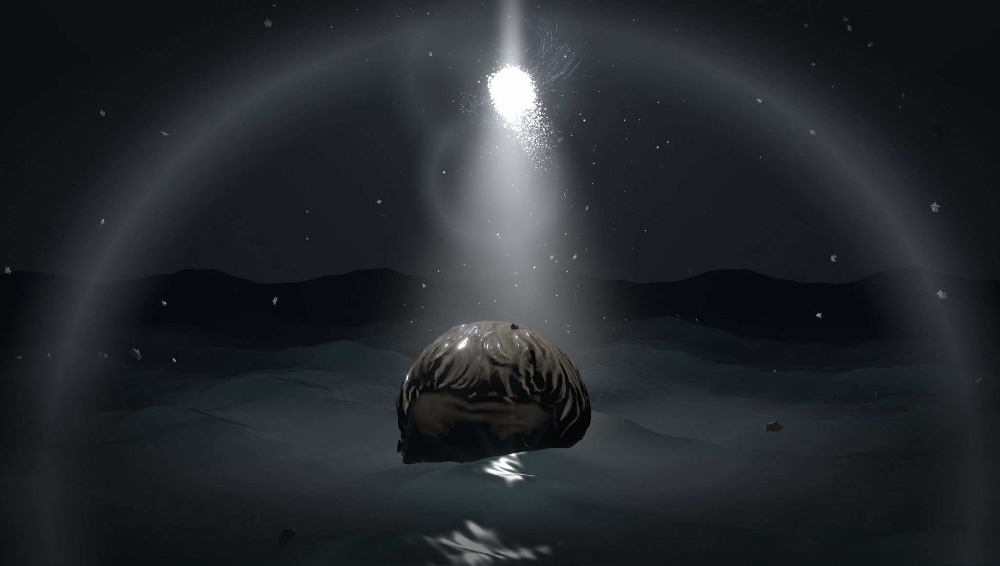
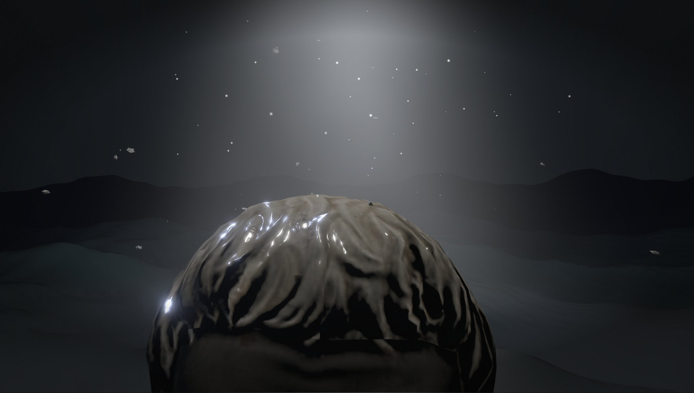
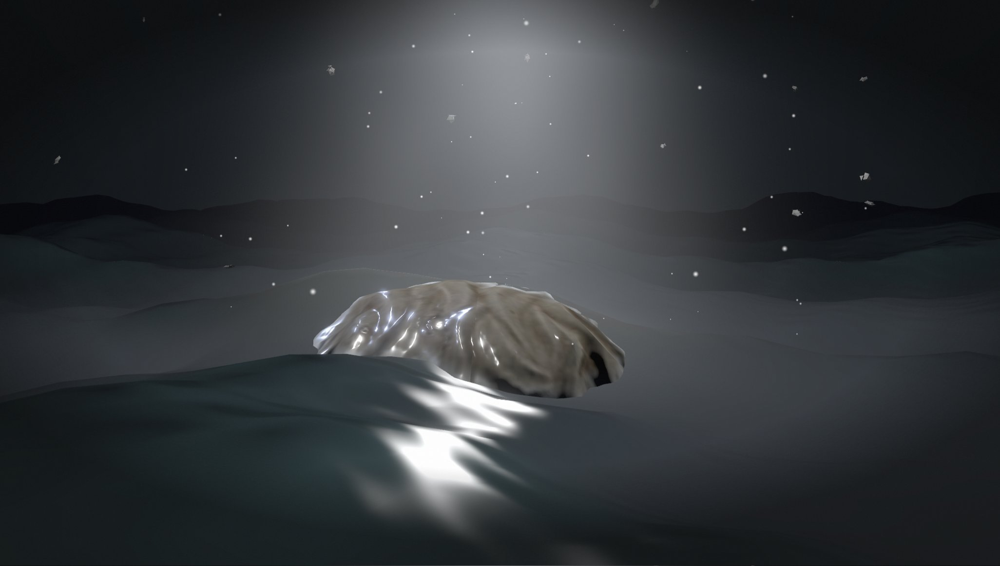
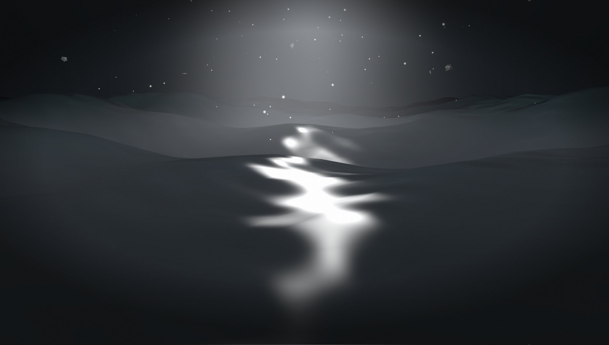

# Nightsail

A giant marble head under a column of light, in a stormy night sea. The tide drowns it and gives it
back: the swell washes over its face, foam clings to the stone at the waterline, and the marble stays
dark and wet for a while after the water leaves. Sparks boil off the core above, threads of a curl
field wind around it and shards drift through the air. Every value that shapes the scene is on a
panel, and a night you like can be sent as a link.

**Live demo:** https://kloserock97-tech.github.io/nightsail/



| Low tide | Rising | High tide |
| --- | --- | --- |
|  |  |  |

## The idea

There is exactly one light in this scene and it stands at a known point. So almost nothing is lit by a
lighting system: the sea, the shards and the air each brighten by how much they face the core and how
close they are to its axis. The head is the one real lit object, and the core lights it from above like
a spotlight.

## The head and the tide

The bust is scaled up until, at low tide, the sea reaches its brows. The tide is a slow rise and fall of
the whole sea on top of the swell, so at high tide the head is gone and only the glint on the water
shows where it was.

The stone knows where the water is. Its shader evaluates the same wave sum the sea draws, at every point
of the marble, so the waterline is exact. Right at the surface there is a torn band of foam. Above it the
stone is darker and glossier up to the highest the water has reached lately; that high-water mark is
kept on the CPU and sinks back slowly, which is what makes the head look like it has only just come out
of the sea.

## The light

- **Column.** A single plane turned to the camera, with a gaussian falloff across it, a pinch at the core
  and a noise texture along it. A plane has no silhouette, which a cone or a cylinder always does. Where it
  cuts through the head it fades by comparing its depth with the scene's, so there is no seam.
- **Core.** 5,400 sparks sampled on an icosphere, each breaking away along its normal and carried by a CPU
  curl-noise field, so the core boils instead of glowing.
- **Threads.** 520 short paths traced through the field once at start-up and baked into ribbons; a bright
  head runs along each. The field does not change, so there is no reason to trace it every frame.
- **Dust and shards.** Sparse sparks settling towards the column and 150 dented rocks drifting up, for
  parallax.
- **Lens.** Bloom, a band blur that softens the top and bottom of the frame, and lens flares drawn from the
  projected position of the core rather than extracted from bright pixels.

## The sea

Four directional sines with sharpened crests, plus three ripples that bend the normal but never move the
surface. The water reflects the same sky panorama that sits behind it, with Schlick fresnel, light through
thin crests, a glint path on the half vector, foam on steep slopes and mist that stays in the troughs.
The sky is an HDR panorama rendered once in Blender Cycles: a light column inside height-falling haze.

## Controls

`H` hides the panel, `Space` freezes time, drag to orbit, scroll to zoom.

| Folder | What's in it |
| --- | --- |
| **Time** | speed of everything |
| **Statue** | size, how high the crown sits, position, turn, lean, brightness, how dark and how far up the wet stone goes, drying time, foam at the waterline |
| **Light** | colour of the light, how strongly it lights the head, moonlight, ambient |
| **Column, Halo** | shape, width and falloff of the column, halo around the core |
| **Core sparks, Threads, Dust, Shards** | everything that moves around the core |
| **Sea** | tide height and period, swell, colours, reflection, ripples, light through crests, foam, glint, mist |
| **Sky and air** | panorama or plain gradient, fog, glow around the column, mist |
| **Lens** | bloom, flare strength, spread and tint, band blur |
| **View** | field of view, camera breathing, auto rotation |

Presets: night, storm, calm, ember, ghost. **Copy link to this night** puts every changed value into the
address. Add `#webgl=1` to force the WebGL2 path.

## Running it

Node 22 or newer.

```bash
npm install
npm run dev       # http://localhost:5173
npm run build     # static site into dist/
npm run preview
node tools/notices.mjs   # after changing dependencies or assets
```

`.github/workflows/deploy.yml` publishes `dist/` to GitHub Pages on every push to `main`.

| File | What it is |
| --- | --- |
| `src/main.js` | renderer, scene, camera, loop |
| `src/statue.js` | the head: placement, wet stone, foam at the waterline |
| `src/ocean.js` | the sea and the tide, in the shader and on the CPU |
| `src/light.js` | column and halo |
| `src/sparks.js` | core sparks and dust |
| `src/flow.js` | baked threads around the core |
| `src/curl.js` | the CPU curl field |
| `src/debris.js` | drifting shards |
| `src/sky.js` | panorama loading and a small RGBE reader |
| `src/post.js` | bloom, band blur, lens flares |
| `src/panel.js` | panel rows, presets, address encoding |

## Performance

About 50 fps at 1368×775 on an Intel Arc integrated GPU, on both the WebGPU and the WebGL2 path, with the
head at low tide filling the middle of the frame.

## Credits

Scene, shaders and panel are my own work. Built with [three.js](https://threejs.org) and
[lil-gui](https://lil-gui.georgealways.com). The head is "Marble Bust 01" by Rico Cilliers from
[Poly Haven](https://polyhaven.com/a/marble_bust_01), released under CC0. The sky was rendered for this
project. Full list with license texts: [THIRD_PARTY_NOTICES.md](THIRD_PARTY_NOTICES.md).

## Licence

Source-available under the [PolyForm Noncommercial License 1.0.0](LICENSE): free for personal,
study, research and other noncommercial use. **Commercial use needs a paid license**, see
[COMMERCIAL.md](COMMERCIAL.md) or write to kloserock97@gmail.com. Third-party parts keep their own
licenses, listed in [THIRD_PARTY_NOTICES.md](THIRD_PARTY_NOTICES.md).

Nikita Gorbachev · kloserock97@gmail.com ·
[LinkedIn](https://www.linkedin.com/in/nikita-gorbachev-productdesigner)
