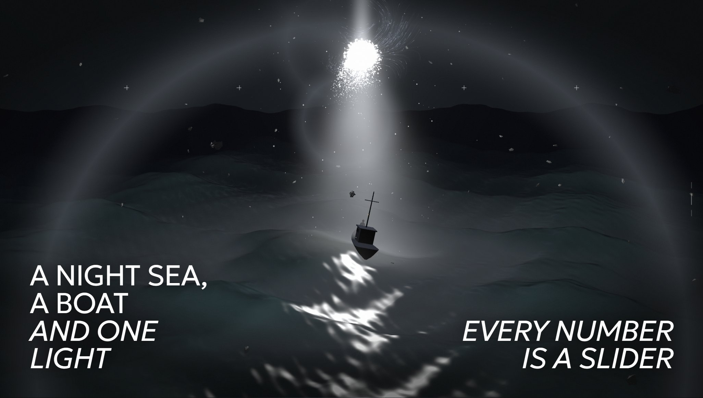
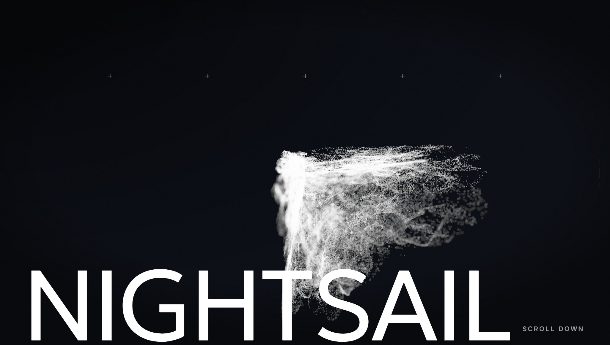
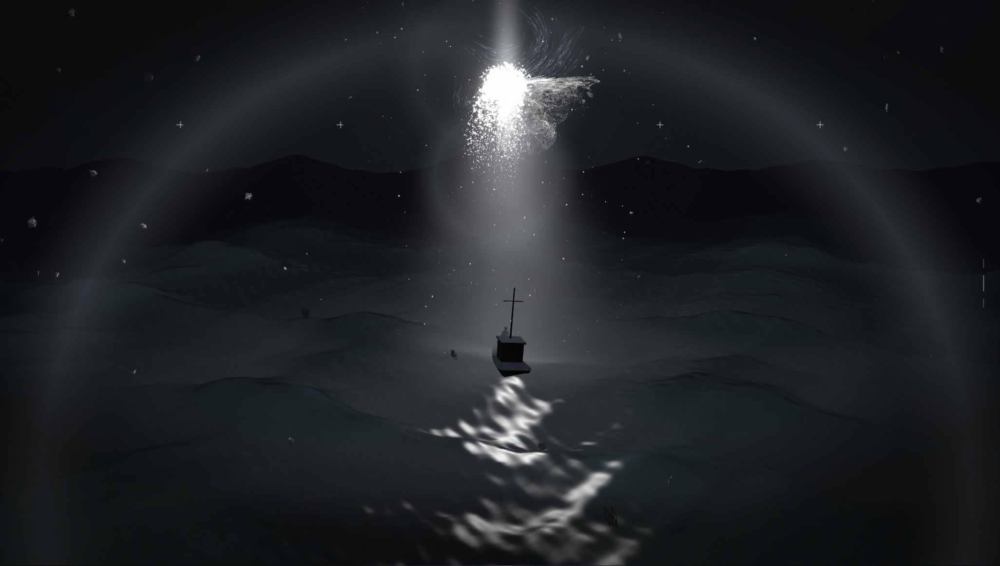
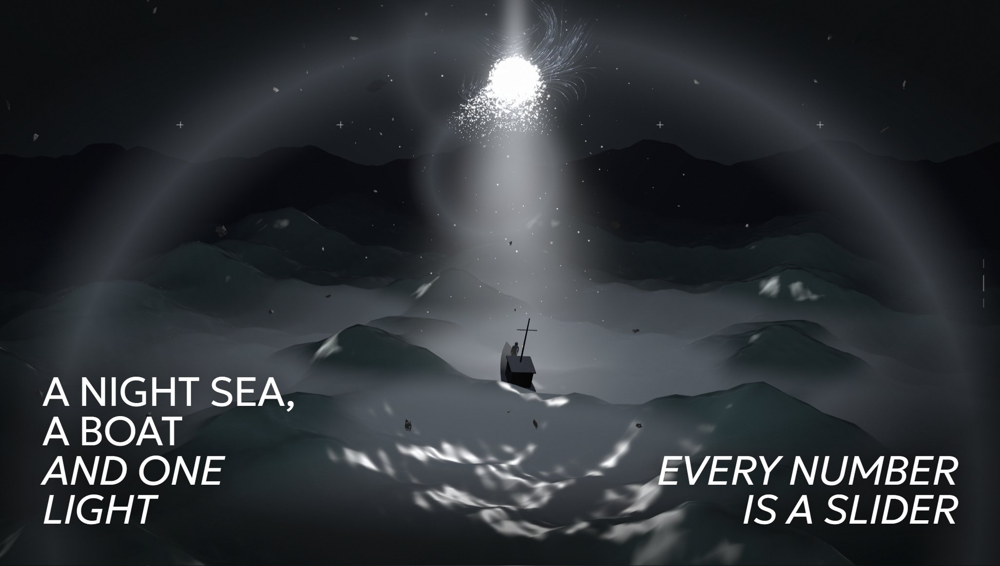
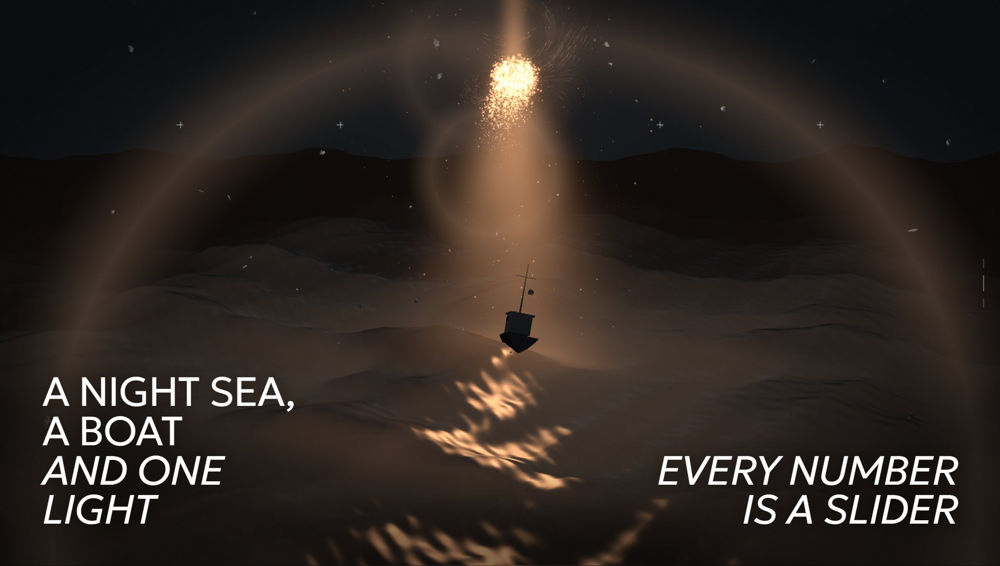

# Nightsail

A bubble of points hangs in the dark. Scroll, and it flies off into the distance, unwinds into threads
and settles as the core of a column of light. Around it a night sea assembles, with a small boat right
under the light and a figure on deck looking up. Scroll back and it all comes apart again.

Every number that shapes the scene is on a panel, and a look you like can be sent as a link.

**Live demo:** https://kloserock97-tech.github.io/nightsail/



| First screen | On the way | Storm | Ember |
| --- | --- | --- | --- |
|  |  |  |  |

## The idea

There is exactly one light in this scene and it stands at a known point. So almost nothing is lit by a
lighting system: the sea, the shards and the air each brighten by how much they face the core and how
close they are to its axis. That is what keeps a frame this busy at a high frame rate, and it is also
what makes the light feel like the only thing in the world.

## The bubble

A quarter of a million points in a curl-noise field, recomputed every frame on the GPU in a compute pass.
Nothing is integrated or stored: a point's position is a pure function of its seed and time, so the cloud
never drifts apart and freezing time freezes it exactly.

The shape comes from three steps. The direction of the field at the seed, normalised, lands the point on a
sphere, which is the only reason the cloud is round. From there it follows the field for a few shrinking
strides, so neighbours walk the same path and draw threads. A slow noise then pushes patches in and out of
the shell, unclamped, so the outline tears. On the flight a single `dissolve` value lengthens the strides
and the bubble unwinds.

The lens is fake: a point's blur disc grows with its distance from the plane of focus, and its light is
spread over that disc. Points in focus are hard grains, the rest are faint wide circles. Distances are in
radii of the cloud, so the look holds while the bubble grows fivefold.

Without WebGPU the same function runs in the vertex stage on 20,000 points.

## The light

- **Column.** A single plane turned to the camera, with a gaussian falloff across it, a pinch at the core
  and a noise texture along it. A plane has no silhouette, which a cone or a cylinder always does. Where it
  cuts through the boat it fades by comparing its depth with the scene's, so there is no seam.
- **Core.** 5,400 sparks sampled on an icosphere, each breaking away along its normal and carried by a CPU
  curl field, so the core boils instead of glowing.
- **Threads.** 520 short paths traced through the field once at start-up and baked into ribbons; a bright
  head runs along each. The field does not change, so there is no reason to trace it every frame.
- **Dust and shards.** Sparse sparks settling towards the column and 150 dented rocks drifting up, for
  parallax.
- **Lens.** Bloom, a band blur that softens the top and bottom of the frame, and lens flares drawn from the
  projected position of the core rather than extracted from bright pixels.

## The sea

Four directional sines with sharpened crests, plus three ripples that bend the normal but never move the
surface. The swell is written once in the shader and once in JavaScript, and the boat takes its height and
tilt from the JavaScript copy, so it rides the crest it is actually on. The water reflects the same
panorama that sits behind it, with Schlick fresnel, light through thin crests, a glint path on the half
vector, foam on steep slopes and mist that stays in the troughs.

The sky is an HDR panorama rendered once in Blender Cycles: a light column inside height-falling haze.

## Controls

Scroll or swipe to travel, `↓` `↑` step through it, `H` hides the interface, `Space` freezes time, `R`
replays the bubble.

| Folder | What's in it |
| --- | --- |
| **Journey** | scroll progress, wheel step, smoothing, time scale |
| **Bubble** | field frequency, speed, spray, f-stop, grain, brightness, framing on the first screen |
| **Light, Column, Halo** | colour of the light, shape and falloff of the column, halo |
| **Core sparks, Threads, Dust, Shards** | everything that moves around the core |
| **Sea** | swell, colours, reflection, ripples, light through crests, foam, glint, mist |
| **Air** | sky gradient, panorama brightness, fog, glow around the column, mist |
| **Lens** | bloom, flare strength and spread, band blur |
| **Camera** | drift, how far the figure looks up |

Presets: night, storm, calm, ember, ghost. **Copy link to this look** puts every changed value into the
address; add `#sea=1` to open straight at the sea and `#webgl=1` to force the WebGL2 path.

## Running it

Node 22 or newer.

```bash
npm install
npm run dev       # http://localhost:5173
npm run build     # static site into dist/
npm run preview
```

`.github/workflows/deploy.yml` publishes `dist/` to GitHub Pages on every push to `main`.

| File | What it is |
| --- | --- |
| `src/main.js` | renderer, scene, the scroll journey, camera |
| `src/bubble.js` | the point cloud: field, fake lens, compute and fallback paths |
| `src/light.js` | column and halo |
| `src/sparks.js` | core sparks and dust |
| `src/flow.js` | baked threads around the core |
| `src/curl.js` | the CPU curl field |
| `src/debris.js` | drifting shards |
| `src/ocean.js` | the sea, in the shader and on the CPU |
| `src/sky.js` | panorama loading and a small RGBE reader |
| `src/boat.js` | hull generator, wheelhouse, the figure |
| `src/post.js` | bloom, band blur, lens flares |
| `src/panel.js` | panel rows, presets, address encoding |

## Performance

On an Intel Arc integrated GPU at 1368×775 it runs at about 70 fps on the sea and 40 fps on the first
screen, where the quarter-million-point compute pass is the whole cost. The WebGL2 path runs at around
75 fps with fewer points.

## Credits

Scene, shaders, field, hull and panel are my own work. Built with [three.js](https://threejs.org) (MIT)
and [lil-gui](https://lil-gui.georgealways.com) (MIT). The figure is "Hoodie Character" by
[Quaternius](https://quaternius.com), released under CC0. The sky was rendered for this project. Titles
are set in Geologica and Onest (SIL Open Font License), loaded from Google Fonts. Details in
[THIRD_PARTY_NOTICES.md](THIRD_PARTY_NOTICES.md).

## Licence

MIT, see [LICENSE](LICENSE).

Nikita Gorbachev · kloserock97@gmail.com ·
[LinkedIn](https://www.linkedin.com/in/nikita-gorbachev-productdesigner)
